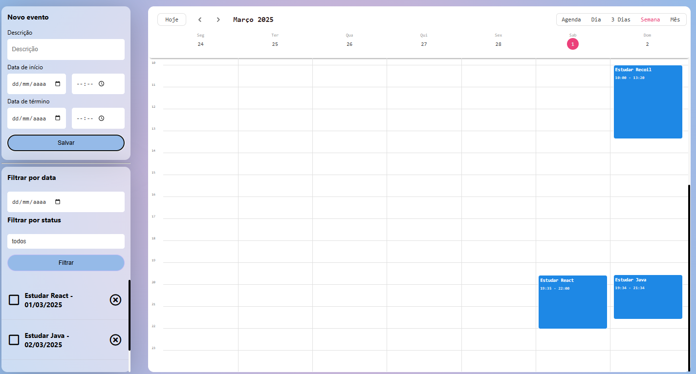

# Event Calendar

## 📌 Sobre o Projeto

O **Event Calendar** é um gerenciador de eventos desenvolvido em **React** com **Recoil** para gerenciamento de estado. A aplicação permite que os usuários **criem, editem, excluam e listem** eventos agendados, além de **filtrar** os eventos por **status** ou **data**.

A interface utiliza a biblioteca **Kalendar** para exibição dos eventos de forma intuitiva e organizada. O projeto se conecta a um **back-end** via API e pode ser executado em um ambiente **Docker**.

## 🚀 Tecnologias Utilizadas

- **React** - Biblioteca principal para construção da interface
- **Recoil** - Gerenciamento de estado global
- **Kalendar (npm)** - Biblioteca para exibição e manipulação de eventos no calendário
- **Docker** - Containerização da aplicação
- **Fetch API** - Comunicação com o back-end

## 🎯 Funcionalidades

✅ Criar novos eventos
✅ Editar eventos existentes
✅ Excluir eventos
✅ Listar todos os eventos
✅ Filtrar eventos por **status** ou **data**
✅ Integração com API do back-end

## 🛠️ Como Executar o Projeto

### 🔹 Pré-requisitos

Antes de começar, você precisará ter instalado em sua máquina:

- **Docker**
- **Node.js** (caso queira rodar fora do Docker)
- **Gerenciador de pacotes** (npm ou yarn)

### 🔹 Clonar o repositórios e deixar na mesma hierarquia

```sh
  git clone https://github.com/Marvinx9/event-calendar
```

e

```sh
  git clone https://github.com/Marvinx9/event-calendar-api
  cd event-calendar-api
```

### 🔹 Rodando com Docker

```sh
  docker-compose up --build
```

### 🔹 Rodando sem Docker

```sh
  npm install  # ou yarn install
  npm start    # ou yarn start
```

A aplicação estará disponível em: **http://localhost:3000**

## 🔗 Conexão com o Back-end

O front-end se comunica com o back-end através de requisições HTTP. As principais rotas utilizadas são:

- `GET /agendamentos` → Lista todos os eventos
- `POST /agendamentos` → Cria um novo evento
- `PUT /agendamentos/:id` → Atualiza um evento existente
- `DELETE /agendamentos/:id` → Remove um evento

## 📸 Demonstração



## 📄 Licença

Este projeto está sob a licença **MIT**. Sinta-se à vontade para usá-lo e modificá-lo! 😊
